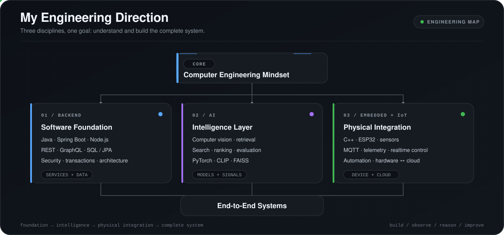
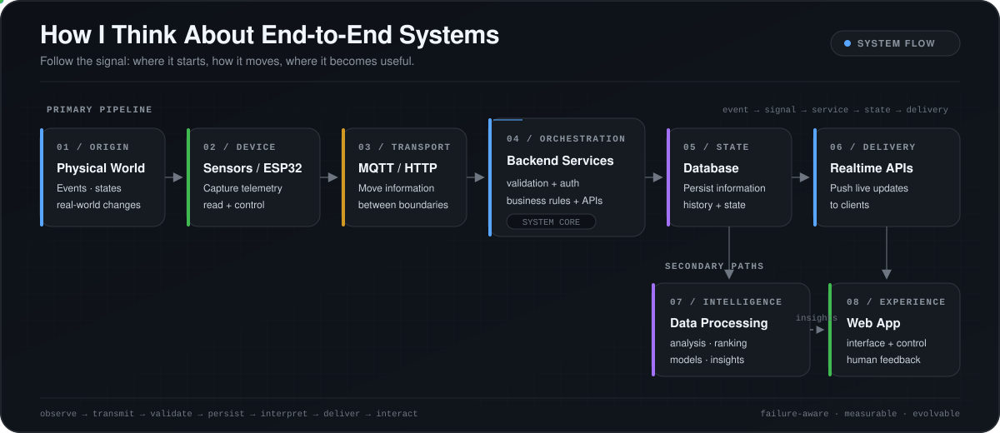
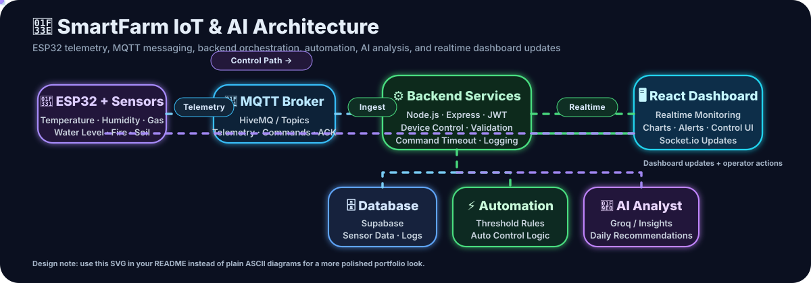
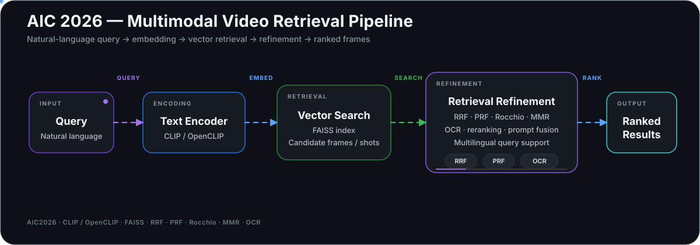
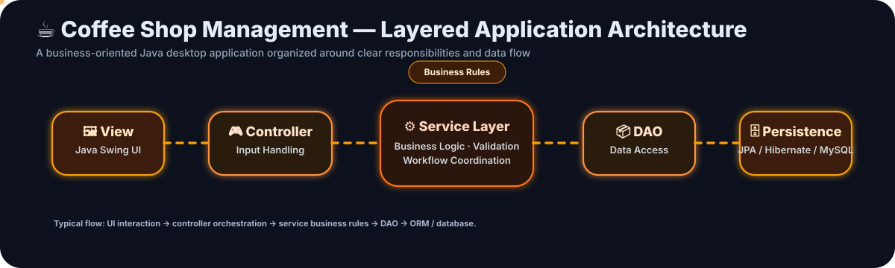

<!-- =========================================================
                         HERO HEADER
========================================================== -->

<p align="center">
  
</p>

<p align="center">
  
</p>

<p align="center">
  <a href="https://github.com/nhatnguyen10a1thd-png">
    
  </a>

  

  
</p>

---

# 👋 Hi, I'm Nhat Nguyen

### `Backend Engineering` × `Artificial Intelligence` × `Embedded / IoT`

I'm a third-year **Information Technology student at HCMUTE**, currently exploring the intersection between **Software Engineering, Artificial Intelligence, and Embedded Systems**.

Rather than limiting myself to one layer of technology, I enjoy understanding how complete systems work:

<p align="center">
  
</p>

What interests me most is the engineering behind the entire pipeline:

**How data is created → transmitted → processed → stored → analyzed → exposed → used.**

I'm currently looking for **entry-level opportunities** where I can continue building real systems, strengthen my fundamentals, and grow as an engineer.

---

# 🧭 My Engineering Direction

<p align="center">
  
</p>

> **I don't want to understand only one layer of a system.  
> I want to understand how the layers connect.**

My current goal is to build a strong software engineering foundation while developing practical experience across **Backend, AI, and Embedded/IoT systems**.

---

# ⚡ Developer Snapshot

<table>
<tr>
<td width="33%" valign="top">

### 🖥️ Backend

I enjoy designing the logic behind applications:

- REST APIs
- Authentication
- Authorization
- Database design
- Transactions
- Business logic
- Layered architecture
- Realtime communication

</td>

<td width="33%" valign="top">

### 🤖 Artificial Intelligence

I'm exploring practical AI through:

- Computer Vision
- Information Retrieval
- Vector Search
- Search Algorithms
- Heuristics
- Ranking
- Multimodal AI
- Model evaluation

</td>

<td width="33%" valign="top">

### 🔌 Embedded / IoT

I enjoy connecting software with the physical world:

- ESP32
- Sensors
- Actuators
- MQTT
- Device control
- Telemetry
- Automation
- Device ↔ Cloud systems

</td>
</tr>
</table>

---

# 🛠️ Tech Stack

## 💻 Programming Languages

<p align="center">
  
</p>

<p align="center">


</p>

---

## ⚙️ Backend Engineering

<p align="center">
  
</p>

<p align="center">


</p>

---

## 🤖 AI / Computer Vision

<p align="center">
  
</p>

<p align="center">


</p>

---

## 🔌 Embedded / IoT

<p align="center">


</p>

---

## 🎨 Frontend

<p align="center">
  
</p>

---

## 🗄️ Database & Cloud

<p align="center">
  
</p>

<p align="center">


</p>

---

## 🧰 Tools & Development Environment

<p align="center">
  
</p>

---

# 🚀 Featured Projects

---

## 🌾 SmartFarm IoT & AI Management System

### `IoT • Backend • Realtime • Automation • AI`

> An end-to-end smart agriculture platform connecting **ESP32 devices, MQTT messaging, backend services, realtime web interfaces, databases, and AI analysis**.

<p>


</p>

### Architecture

<p align="center">
  
</p>

### Engineering highlights

- Realtime environmental telemetry
- ESP32 sensor integration
- MQTT publish / subscribe communication
- Device command system
- Command acknowledgement mechanism
- Command timeout handling
- Remote actuator control
- Automatic threshold-based automation
- Low-water safety protection
- JWT authentication
- Role-based permissions
- Supabase persistence
- Socket.io realtime updates
- System activity logs
- AI-generated daily analysis and recommendations

### What this project represents

This project reflects the type of engineering I enjoy the most:

> **connecting hardware, communication protocols, backend systems, data, AI, and frontend applications into one complete system.**

🔗 **Repository:**  
https://github.com/nhatnguyen10a1thd-png/Smart-farm-iot

---

## 🎥 AIC 2026 — AI Video Retrieval

### `Computer Vision • Multimodal AI • Information Retrieval`

A video retrieval system that uses natural-language queries to search visual content through embedding-based similarity.

<p>


</p>

### Retrieval pipeline

<p align="center">
  
</p>

### Topics explored

- CLIP / OpenCLIP embeddings
- Vector similarity search
- FAISS indexing
- Multimodal information retrieval
- Multi-prompt querying
- Reciprocal Rank Fusion
- Pseudo Relevance Feedback
- Rocchio query expansion
- Maximum Marginal Relevance
- OCR-assisted retrieval
- Multilingual queries
- Retrieval evaluation

### What this project represents

This project is where I explore AI beyond model inference — focusing on the entire **retrieval system**, including indexing, ranking, evaluation, and reliability.

🔗 **Repository:**  
https://github.com/nhatnguyen10a1thd-png/AIC2026

---

## ☕ Coffee Shop Management System

### `Java • OOP • JPA • Business Logic • Desktop Application`

A Java-based management application designed around realistic coffee-shop operations.

<p>


</p>

### Architecture

<p align="center">
  
</p>

### Main modules

- Authentication
- User & role management
- Product management
- Category management
- Table management
- POS ordering
- Invoice management
- Ingredient management
- Recipe management
- Supplier management
- Inventory management
- Import management
- Statistics dashboard
- Offline / demo fallback

### What this project represents

This project strengthened my understanding of:

**OOP · Layered Architecture · Domain Modeling · Persistence · Business Logic · Application Structure**

🔗 **Repository:**  
https://github.com/nhatnguyen10a1thd-png/Coffe-Management

---

## 🧠 Squirrels AI Solver

### `Artificial Intelligence • Search • Heuristics • CSP`

An interactive AI project for solving and visualizing a 4×4 puzzle environment.

The system explores **18 AI algorithms** across several families.

### Uninformed Search

`BFS` · `DFS` · `IDS`

### Informed Search

`Greedy Best-First` · `A*` · `IDA*`

### Local Search

`Hill Climbing` · `Local Beam Search` · `Simulated Annealing`

### Complex Search

`AND-OR Search` · `Belief-State Search` · `LRTA*`

### Constraint Satisfaction

`Backtracking` · `AC-3` · `Min-Conflicts`

### Adversarial / Stochastic Search

`Minimax` · `Alpha-Beta Pruning` · `Expectimax`

### What this project represents

Rather than only implementing algorithms, this project helped me understand:

**state representation → heuristic design → search space → algorithm behavior → performance comparison**

🔗 **Repository:**  
https://github.com/nhatnguyen10a1thd-png/AI_Project

---

# 🧪 Engineering Labs

Not every repository on my GitHub is intended to be a complete product.

Some repositories are intentionally smaller experiments where I isolate and practice specific technologies before using them in larger projects.

### Backend Labs

`Spring Boot`

`Spring Security`

`JWT Authentication`

`GraphQL`

`JPA / Hibernate`

`Jakarta Servlet`

`Thymeleaf`

`REST API`

`MVC`

These repositories represent my **learning process**, while the Featured Projects above represent how I combine those concepts into larger systems.

---

# 🧠 My Engineering Mindset

I don't want to become the developer who only asks:

> **“How do I make this feature work?”**

I also want to ask:

```text
Why does it work?
        │
        ▼
What happens when it fails?
        │
        ▼
What happens with invalid data?
        │
        ▼
What happens when multiple processes interact?
        │
        ▼
How does the system communicate?
        │
        ▼
Can the architecture evolve?
        │
        ▼
Can another developer understand it?
        │
        ▼
How can I measure whether it actually works well?
```

For me, engineering means thinking about more than the happy path.

That is why I'm actively improving in:

**Problem Solving**

**Backend Engineering**

**Software Architecture**

**Database Design**

**Artificial Intelligence**

**Embedded Systems**

**System Integration**

**Testing & Reliability**

---

# 🔭 Current Engineering Focus

```yaml
backend:
  - Java
  - Spring Boot
  - REST API Design
  - Authentication & Authorization
  - Database Design
  - JPA / Hibernate
  - Transactions
  - Software Architecture

artificial_intelligence:
  - Computer Vision
  - Multimodal Retrieval
  - Vector Search
  - Search & Ranking
  - PyTorch
  - Model Evaluation

embedded_iot:
  - ESP32
  - C++
  - MQTT
  - Sensors & Actuators
  - Device Communication
  - Realtime Systems
  - Automation

engineering:
  - Clean Code
  - System Design
  - Testing
  - Git
  - Docker
  - Linux
```

---

# 🧑‍💻 How I Build

Most of the major projects on this profile are **independently developed projects**.

I use modern development tools — including AI-assisted tools — for research, debugging, brainstorming, and accelerating repetitive work.

But my focus remains on understanding and owning the engineering decisions behind:

```text
Problem
   ↓
Requirements
   ↓
Architecture
   ↓
Implementation
   ↓
Testing
   ↓
Integration
   ↓
Evaluation
   ↓
Iteration
```

AI can accelerate development.

**Understanding the system is still the responsibility of the engineer.**

---

# 🎯 What I'm Looking For

I'm currently open to **entry-level opportunities** involving:

<p align="center">


</p>

I'm especially interested in environments where I can:

- Work on real engineering problems
- Learn from experienced developers
- Understand production-level systems
- Strengthen software engineering fundamentals
- Build systems across multiple technical layers

---

# 📊 GitHub Activity

<p align="center">
  

  
</p>

<p align="center">
  
</p>

---

# 🏆 GitHub Trophies

<p align="center">
  
</p>

---

# 📈 Contribution Graph

<p align="center">
  
</p>

---

# 🤝 Let's Connect

<p align="center">

<a href="https://github.com/nhatnguyen10a1thd-png">

</a>

<a href="YOUR_LINKEDIN_URL">

</a>

<a href="mailto:YOUR_EMAIL">

</a>

</p>

---

<p align="center">

### `Build.` `Experiment.` `Understand.` `Improve.`

<sub>
I don't want to collect technologies.<br/>
I want to understand how systems work.
</sub>

</p>

<p align="center">
  
</p>
